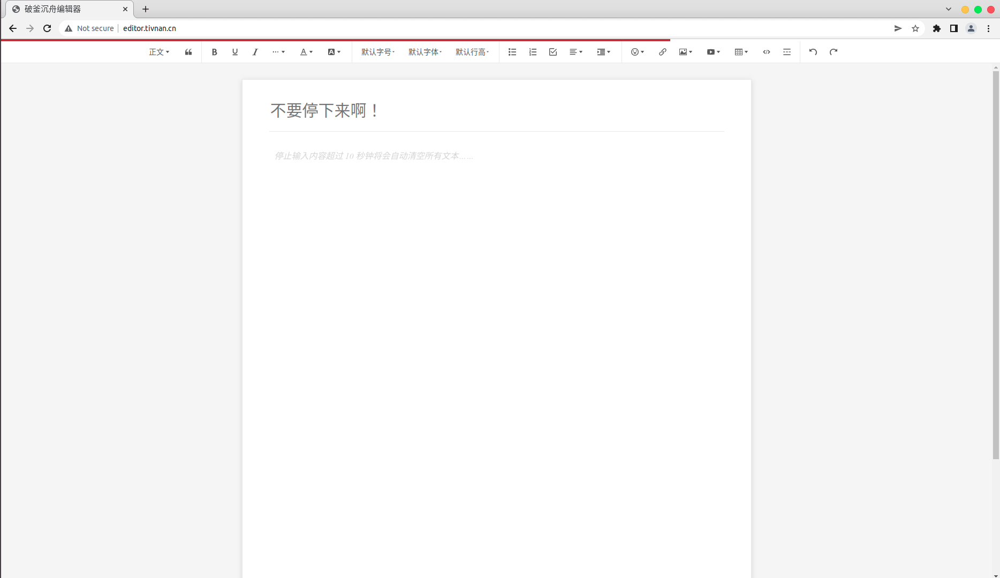

# 破釜沉舟编辑器（No Way Back Editor）

## 前言

为了解决大家写论文时刚写了一百字就开始刷微博刷B站看电影看综艺躺平三个小时最后发现ddl越来越靠近然后感觉到一阵空虚的问题，我们开发了这款破釜沉舟论文编辑器

该款编辑器对编写论文时的懒惰心理、编写报告频繁打开手机进行摆烂的行为、受主观意识影响而导致导致论文编写中断等情况有极大抑制效果。

我们的宗旨是，只有无限接近死亡，才能体会生命的真谛！

## 特性

- v0.1版本：

  - 带富文本编辑功能

  - 倒计时进度条

  - 倒计时清空功能，一旦触发编辑，超过十秒未输入新内容将清空所有文本

- v0.2版本：（正在开发中）

  - 编写前可以自定义字数档位（1000/2000/5000字），倒计时档位（10/30/60）秒

  - 未完成字数档位前，禁止复制导出内容

  - 每篇文章3次超长续杯暂停倒计时（10分钟）的次数，用于用户处理论文写作外的突发事件

  - ……

- v0.3版本：（正在规划中）

  - ”只言片语”：成功完成一次编写之后可在网站中留下一段话，供后来者瞻仰

  - “无职转生”：由于中断而导致被销毁的文本有机会出现在网站首页，供后来者反思

  - ……

## 运行截图

## 引用资源

- [wangEditor 5](https://www.wangeditor.com/)

- [webpack](https://webpack.js.org/)

- ……
